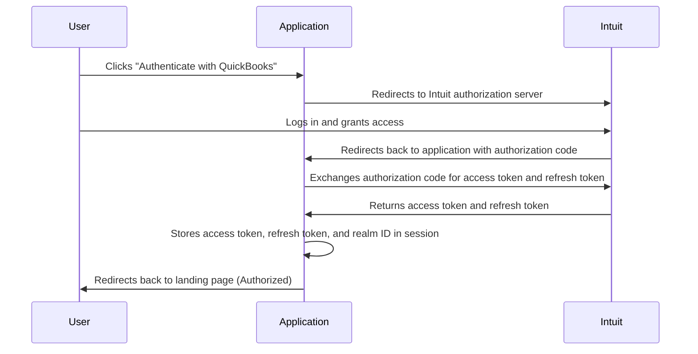
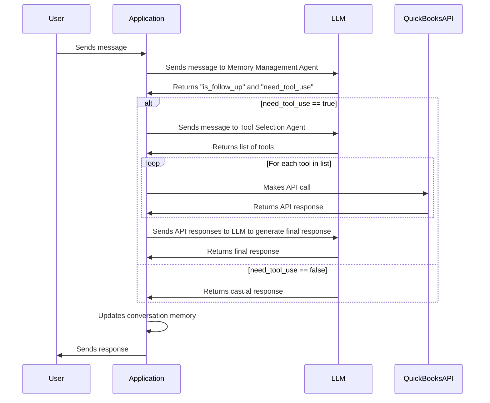

# QuickBooks API Chatbot: A Comprehensive Guide

## Table of Contents

1.  [Introduction](#introduction)
2.  [Project Structure](#project-structure)
3.  [Core Components](#core-components)
    *   [Authentication Flow](#authentication-flow)
    *   [Chat Handling](#chat-handling)
    *   [Tool Execution](#tool-execution)
    *   [Memory Management](#memory-management)
    *   [API Calls](#api-calls)
    *   [LLM Integration](#llm-integration)
    *   [Prompt Engineering](#prompt-engineering)
    *   [Streaming Chat](#streaming-chat)
4.  [Code Walkthrough](#code-walkthrough)
    *   [manage.py](#managepy)
    *   [app/main/config.py](#appmainconfigpy)
    *   [app/main/bot/chat.py](#appmainbotchatpy)
    *   [app/main/tool\_operations/auth/OAuth2Helper.py](#appmaintool_operationsauthoauth2helperpy)
    *   [app/main/tool\_operations/service/tool\_execution.py](#appmaintool_operationsservicetoolexecutionpy)
    *   [app/main/tool\_operations/utils/api\_call.py](#appmaintool_operationsutilsapicallpy)
    *   [app/main/tool\_operations/utils/context.py](#appmaintool_operationsutilscontextpy)
    *   [app/main/tool\_operations/utils/llm.py](#appmaintool_operationsutillsllmpy)
    *   [app/main/tool\_operations/utils/prompt\_helper.py](#appmaintool_operationsutilsprompt_helperpy)
    *   [app/main/tool\_operations/utils/memory/memory.py](#appmaintool_operationsutilsmemorymemorypy)
    *   [app/main/tool\_operations/utils/memory/memory.json](#appmaintool_operationsutilsmemorymemoryjson)
    *   [app/main/tool\_operations/utils/prompt\_versions/memory\_agent/prompt\_vlatest.py](#appmaintool_operationsutilsprompt_versionsmemory_agentprompt_vlatestpy)
    *   [app/main/tool\_operations/utils/prompt\_versions/tool\_agent/prompt\_vlatest.py](#appmaintool_operationsutilsprompt_versionstool_agentprompt_vlatestpy)
    *   [templates/index.html](#templatesindexhtml)
    *   [templates/chat-stream.html](#templateschat-streamhtml)
5.  [Configuration](#configuration)
6.  [Dependencies](#dependencies)
7.  [Setup and Installation](#setup-and-installation)
8.  [Usage](#usage)
9.  [Diagrams](#diagrams)
    *   [Authentication Flow Diagram](#authentication-flow-diagram)
    *   [Chatbot Workflow Diagram](#chatbot-workflow-diagram)
10. [Error Handling and Troubleshooting](#error-handling-and-troubleshooting)
11. [Extensibility and Future Enhancements](#extensibility-and-future-enhancements)
12. [Security Considerations](#security-considerations)
13. [Contribution](#contribution)
14. [License](#license)

## 1. Introduction

This project implements a chatbot that interacts with the QuickBooks Online API to provide users with information and perform actions on their QuickBooks data.  It leverages Large Language Models (LLMs) such as Gemini or OpenAI to understand user queries, determine the necessary API calls, and present the results in a user-friendly manner. The chatbot supports both standard request-response interactions and streaming responses using Server-Sent Events (SSE), providing a more interactive and real-time experience. This README provides a comprehensive guide to the project, covering its architecture, components, configuration, usage, and potential for future enhancements.

## 2. Project Structure

The project follows a modular structure, making it easier to understand, maintain, and extend. Here's a breakdown of the directory structure:

```
.
├── README.md             # This file
├── pycache                # Compiled Python files (ignore)
├── app                    # Main application directory
│   ├── __init__.py        # Initializes the app package
│   ├── main               # Contains the core application logic
│   │   ├── __init__.py    # Initializes the main package
│   │   ├── bot            # Chatbot related files
│   │   │   ├── __init__.py
│   │   │   ├── chat.py     # Main chat handler logic
│   │   ├── config.py      # Application-specific configurations
│   │   └── tool_operations # Directory for handling tool (QuickBooks API) interactions
│   │       ├── __init__.py
│   │       ├── auth         # Authentication related modules
│   │       │   ├── OAuth2Helper.py # Handles OAuth2 authentication flow
│   │       │   ├── __init__.py
│   │       ├── service      # Services for executing tools
│   │       │   ├── __init__.py
│   │       │   ├── tool_execution.py # Executes individual tools or workflows
│   │       └── utils        # Utility modules
│   │           ├── __init__.py
│   │           ├── api_call.py # Handles API calls to QuickBooks
│   │           ├── context.py  # Manages request context (authentication details)
│   │           ├── llm.py      # Integrates with LLMs
│   │           ├── memory     # Manages conversation memory
│   │           │   ├── __init__.py
│   │           │   ├── memory.json # Stores the conversation memory
│   │           │   ├── memory.py   # Handles memory operations
│   │           ├── prompt_helper.py # Generates prompts for LLMs
│   │           ├── prompt_versions # Different prompt versions for agents
│   │           │   ├── memory_agent # Prompts for the memory management agent
│   │           │   │   ├── prompt_v1.py
│   │           │   │   ├── prompt_v2.py
│   │           │   │   ├── prompt_v3.py
│   │           │   │   └── prompt_vlatest.py # The most up-to-date prompt
│   │           │   └── tool_agent  # Prompts for the tool selection agent
│   │           │       ├── prompt_v1.py
│   │           │       ├── prompt_v2.py
│   │           │       ├── prompt_v3.py
│   │           │       ├── prompt_v4.py
│   │           │       └── prompt_vlatest.py # The most up-to-date prompt
│   │           └── tools      # Tool definitions
│   │               └── qbo_tools.json # JSON file containing tool definitions for QuickBooks API operations
│   └── test               # Test directory
│       └── __init__.py
├── forgetable_items.txt  # List of items to ignore in version control (credentials, etc.)
├── manage.py            # Main entry point for the Flask application
├── pyproject.toml         # Specifies build system requirements for the project
├── templates            # HTML templates for the web interface
│   ├── chat-stream.html # HTML template for the streaming chat interface
│   ├── chat.html       # HTML template for the standard chat interface
│   └── index.html       # HTML template for the main landing page
└── uv.lock             # A lock file that tracks the state of the environment

```

## 3. Core Components

The chatbot's functionality is built upon several core components, each responsible for a specific aspect of the system.

### Authentication Flow

The application uses OAuth 2.0 to authenticate with the QuickBooks Online API. The authentication flow involves the following steps:

1.  **User initiates authentication:** The user clicks the "Authenticate with QuickBooks" button on the landing page (`index.html`).
2.  **Redirect to Intuit:** The application redirects the user to the Intuit authorization server with the necessary parameters (client ID, redirect URI, scopes, state).
3.  **User grants access:** The user logs in to their QuickBooks Online account and grants the application access to their data.
4.  **Callback to application:** Intuit redirects the user back to the application's callback URL (`/callback`) with an authorization code.
5.  **Token exchange:** The application exchanges the authorization code for an access token and a refresh token.
6.  **Session storage:** The access token, refresh token, and realm ID (company ID) are stored in the user's session.
7.  **Authorized:** The user is now authorized to use the chatbot.

### Chat Handling

The `chat_handler` function in `app/main/bot/chat.py` is the central component for processing user messages.  It orchestrates the interaction between the LLM, tool selection, tool execution, and memory management components. It leverages two agents:

*   **Agent 1 (Memory Management Agent):** Determines if the user query is a follow-up and whether tool use is required. The prompt for this agent is defined in `memory_management_prompt` in `app/main/tool_operations/utils/prompt_helper.py`.
*   **Agent 2 (Tool Selection Agent):** If tool use is required, this agent selects the appropriate QuickBooks Online API tools to use based on the user's query. The prompt for this agent is defined in `tool_use_prompt` in `app/main/tool_operations/utils/prompt_helper.py`.

### Tool Execution

The `tool_execution.py` module in `app/main/tool_operations/service/` contains the logic for executing the QuickBooks Online API tools selected by Agent 2.  The `execute_simple_workflow` function executes a sequential workflow of tools, making API calls and handling responses.

### Memory Management

The `memory.py` module in `app/main/tool_operations/utils/memory/` handles conversation memory. It stores the conversation history and tool execution responses in a JSON file (`memory.json`). This allows the chatbot to understand the context of the conversation and provide more relevant responses.

### API Calls

The `api_call.py` module in `app/main/tool_operations/utils/` handles the actual API calls to the QuickBooks Online API. It provides functions for making GET and POST requests, handling authentication, and constructing URLs.

### LLM Integration

The `llm.py` module in `app/main/tool_operations/utils/` handles the integration with Large Language Models (LLMs) such as Gemini or OpenAI. It provides functions for initializing the LLM and calling it with a prompt. It also provides streaming response capabilities.

### Prompt Engineering

The `prompt_helper.py` module in `app/main/tool_operations/utils/` contains functions for generating prompts for the LLM. These prompts are carefully designed to guide the LLM to understand the user's query, select the appropriate tools, and generate a final response.

### Streaming Chat

The chatbot supports streaming responses using Server-Sent Events (SSE). The `/stream-chat` route in `manage.py` handles SSE connections. When a user sends a message, the application processes it and sends the response chunks to the client in real-time. This provides a more interactive and real-time experience.

## 4. Code Walkthrough

This section provides a detailed walkthrough of the most important code files in the project.

### manage.py

This file is the main entry point for the Flask application. It defines the routes, handles authentication, and interacts with the chatbot logic.

```python
import json
from flask import Flask, jsonify, request, redirect, url_for, session, g, flash, render_template, Response
import time
import requests
import urllib
from werkzeug.exceptions import BadRequest
from app.main.bot.chat import chat_handler
from app.main.tool_operations.utils import context
from app.main.tool_operations.auth import OAuth2Helper
import app.main.config as config
import uuid
from collections import deque
import threading

# configuration
SECRET_KEY = 'dev key'
DEBUG = True

# setup flask
app = Flask(__name__)
app.debug = DEBUG
app.secret_key = SECRET_KEY
response_queues = {}
response_lock = threading.Lock()


@app.route('/')
def index():
    """Index route"""

    return render_template(
        'index.html',

        title="QB Customer Leads",
    )


@app.route('/bot')
def bot():
    """bot route"""


    return render_template(
        'chat.html',

    )

@app.route('/bot-stream')
def bot_stream():
    """bot stream route"""


    return render_template(
        'chat-stream.html',

    )


@app.route('/auth')
def auth():
    """Initiates the Authorization flow after getting the right config value"""
    params = {
        'scope': 'com.intuit.quickbooks.accounting',
        'redirect_uri': config.REDIRECT_URI,
        'response_type': 'code',
        'client_id': config.CLIENT_ID,
        'state': csrf_token()
    }
    url = OAuth2Helper.get_discovery_doc()['authorization_endpoint'] + '?' + urllib.parse.urlencode(params)
    return redirect(url)

@app.route('/reset-session')
def reset_session():
    """Resets session"""
    session.pop('qbo_token', None)
    session['is_authorized'] = False
    return redirect(request.referrer or url_for('index'))

@app.route('/callback')
def callback():
    """Handles callback only for OAuth2"""
    #session['realmid'] = str(request.args.get('realmId'))
    state = str(request.args.get('state'))
    error = str(request.args.get('error'))
    if error == 'access_denied':
        return redirect(index)
    if state is None:
        return BadRequest()
    elif state != csrf_token():  # validate against CSRF attacks
        return BadRequest('unauthorized')

    auth_code = str(request.args.get('code'))
    if auth_code is None:
        return BadRequest()

    bearer = OAuth2Helper.get_bearer_token(auth_code)
    realmId = str(request.args.get('realmId'))

    # update session here
    session['is_authorized'] = True
    session['realm_id'] = realmId
    session['access_token'] = bearer['access_token']
    session['refresh_token'] = bearer['refresh_token']

    return redirect(url_for('index'))

def csrf_token():
    token = session.get('csrfToken', None)
    if token is None:
        token = OAuth2Helper.secret_key()
        session['csrfToken'] = token
    return token


@app.route('/chat', methods=['POST'])
def handle_chat():
    """Handle chat messages from the user"""
    data = request.json
    user_message = data.get('message', '')

    # Get session from request context
    req_context = get_request_context()

    # Process message with chat handler
    response = chat_handler(req_context, user_message)
    if not isinstance(response, str):
        response = response.content

    return jsonify({
        'response': response
    })

@app.route('/stream-chat', methods=['GET', 'POST'])
def stream_chat():
    """Stream chat responses using Server-Sent Events"""

    # Handle the POST request - process the message and queue response chunks
    if request.method == 'POST':
        data = request.json
        user_message = data.get('message', '')
        client_id = data.get('client_id', str(uuid.uuid4()))

        # Get session from request context
        req_context = get_request_context()

        # Create a new response queue for this request
        with response_lock:
            response_queues[client_id] = deque()

        # Process message with chat handler in a separate thread
        def process_message():
            try:
                # Process message with chat handler
                for response_chunk in chat_handler(req_context, user_message):
                    # Queue each yielded chunk directly
                    with response_lock:
                        if client_id in response_queues:
                            response_queues[client_id].append(response_chunk)

                # Add end marker
                with response_lock:
                    if client_id in response_queues:
                        response_queues[client_id].append(None)
            except Exception as e:
                # Handle any errors
                with response_lock:
                    if client_id in response_queues:
                        response_queues[client_id].append(f"Error: {str(e)}")
                        response_queues[client_id].append(None)  # End marker

        # Start processing in background
        threading.Thread(target=process_message).start()

        # Return the client ID to be used for the SSE connection
        return jsonify({
            'client_id': client_id
        })

    # Handle the GET request - establish SSE connection and stream responses
    elif request.method == 'GET':
        # Get client ID from query parameter
        client_id = request.args.get('client_id')

        if not client_id or client_id not in response_queues:
            return jsonify({'error': 'Invalid or missing client ID'}), 400

        def generate():
            """Generator function for SSE"""
            try:
                # Send event to mark the start of the response
                yield 'event: start\ndata: Starting response\n\n'

                # Keep checking the queue until we get the end marker (None)
                while True:
                    # Check if there are chunks available
                    with response_lock:
                        if client_id in response_queues and response_queues[client_id]:
                            chunk = response_queues[client_id].popleft()

                            # If we get the end marker, break the loop
                            if chunk is None:
                                break

                            # Send the chunk
                            data = json.dumps({'chunk': chunk})
                            yield f'data: {data}\n\n'

                    # Short sleep to prevent CPU spinning
                    time.sleep(0.05)

                # Send event to mark the end of the response
                yield 'event: end\ndata: Response complete\n\n'

                # Clean up the queue
                with response_lock:
                    if client_id in response_queues:
                        del response_queues[client_id]

            except GeneratorExit:
                # Client disconnected, clean up
                with response_lock:
                    if client_id in response_queues:
                        del response_queues[client_id]

        return Response(generate(), mimetype='text/event-stream')

def simulate_streaming(text):
    """Helper function to simulate streaming by breaking text into chunks"""
    words = text.split()
    chunks = []

    # Create chunks of ~5 words each
    for i in range(0, len(words),2):
        chunk = ' '.join(words[i:i+2])
        if i + 2 < len(words):
            chunk += ' '  # Add space if not the last chunk
        chunks.append(chunk)

    return chunks


def get_request_context():
    """Get request context with authentication info"""
    from collections import namedtuple

    # Create a simple context object with necessary authentication info
    RequestContext = namedtuple('RequestContext', ['access_token', 'realm_id'])

    # Get access token and realm ID from session
    access_token = session.get('access_token')
    realm_id = session.get('realm_id')

    return RequestContext(access_token=access_token, realm_id=realm_id)

if __name__ == '__main__':
    app.run()
```

**Key functionalities:**

*   **Routes:** Defines the main routes for the application: `/`, `/auth`, `/callback`, `/chat`, and `/stream-chat`.
*   **Authentication:** Handles the OAuth 2.0 authentication flow with QuickBooks Online.
*   **Chat handling:** Receives user messages and calls the `chat_handler` function to process them.
*   **Streaming chat:** Implements the streaming chat functionality using Server-Sent Events (SSE).
*   **Request context:** Creates a `RequestContext` object containing the authentication information for API calls.

### app/main/config.py

This file contains the configuration settings for the application, such as the client ID, client secret, redirect URI, and API version.

```python
DEBUG = False
SQLALCHEMY_ECHO = False

# OAuth2 credentials
CLIENT_ID= ''
CLIENT_SECRET = ''
# REDIRECT_URI = 'https://vksplgr2-5000.uks1.devtunnels.ms/callback'
REDIRECT_URI = 'http://localhost:5000/callback'
AUTH_TYPE='OAuth2'
# Choose environment; default is sandbox
ENVIRONMENT = 'Sandbox'
# ENVIRONMENT = 'Production'

# Set to latest at the time of updating this app, can be be configured to any minor version
API_MINORVERSION = '75'

GOOGLE_AI_API_KEY=""
OPEN_AI_API_KEY=""
```

**Important settings:**

*   `CLIENT_ID`: The client ID of your QuickBooks Online application.
*   `CLIENT_SECRET`: The client secret of your QuickBooks Online application.
*   `REDIRECT_URI`: The redirect URI that you configured in your QuickBooks Online application.
*   `ENVIRONMENT`: The environment to use (Sandbox or Production).
*    `API_MINORVERSION`: The version of quickbook online api

### app/main/bot/chat.py

This file contains the core chat handling logic. It receives user messages, determines the appropriate API calls, and generates a response.

```python
import json
import logging

from app.main.tool_operations.service.tool_execution import execute_simple_workflow
# from app.main.tool_operations.utils import api_call
from app.main.tool_operations.utils.llm import call_llm, streaming_call_llm
from app.main.tool_operations.utils.memory.memory import get_or_create_memory, update_memory, reset_memory
from app.main.tool_operations.utils.prompt_helper import create_final_prompt, memory_management_prompt, tool_use_prompt
# from app.main.tool_operations.service.workflow_executor import WorkflowExecutor

logger = logging.getLogger(__name__)


def chat_handler(request_context, user_query, conversation_history=""):
    """
    Enhanced chat handler with support for complex workflows and streaming responses.

    Yields incremental results after completing each major operation, allowing
    for real-time updates to the client.
    """
    # get memory state
    memory_state = get_or_create_memory()

    # Step 1: Determine the query state using Agent1
    yield "Analyzing your query...\n\n"
    agent1_prompt = memory_management_prompt(user_query, str(memory_state))
    agent1_response = call_llm(agent1_prompt)
    try:
        agent1_data = json.loads(agent1_response)
        yield "Query analysis complete.\n\n"
    except json.JSONDecodeError as e:
        logger.error(f"Error parsing Agent1 response: {agent1_response}, {e}")
        yield "Error processing the response from Agent1.\n\n"
        return

    # If no tool use is required, simply return the casual response.
    if not agent1_data.get("need_tool_use", False):
        casual_response = agent1_data.get("no_tool_use_response", "How can I assist you?")
        if casual_response is None:
            casual_response = "please come again or asked you question all the way from the beginning"
        memory_state['conversation_history'] += '\nUser Request:\n' + user_query
        memory_state['conversation_history'] += '\nAgent Response:\n' + str(casual_response)
        update_memory(memory_state)
        yield casual_response
        return

    # Step 2: Generate the prompt for Agent2 to determine necessary tool execution.
    yield "Determining necessary tools...\n\n"
    agent2_prompt = tool_use_prompt(user_query)
    agent2_response = call_llm(agent2_prompt)
    try:
        agent2_data = json.loads(agent2_response)
        yield "Tool determination complete.\n\n"
    except json.JSONDecodeError:
        logger.error(f"Error parsing Agent2 response: {agent2_response}")
        yield "Error processing the response from Agent2.\n"
        return

    memory_state['conversation_history'] += '\nUser Request:\n' + user_query
    memory_state['conversation_history'] += '\nAgent Response:\n' + str(agent2_data)

    # Check if additional parameters are required before tool execution.
    if agent2_data.get("need_additional_parameters_from_user", False):
        update_memory(memory_state)
        follow_ups = agent2_data.get("follow_ups", "Additional parameters are needed to proceed.")
        yield follow_ups
        return

    # Get the tools and workflow description
    tools_to_use = agent2_data.get("tools", [])
    request_context = request_context

    # Use the original sequential tool execution for simple workflows
    yield "Executing tools...\n\n"
    tool_execution_responses = {}

    # Execute each tool and yield progress updates
    for tool in tools_to_use:
        tool_name = tool.get("tool_name", "unknown tool")
        yield f"Running {tool_name}...\n\n"


    tool_execution_responses = None
    for tool_res in execute_simple_workflow(tools_to_use, request_context):
        if isinstance(tool_res, str):
           yield  tool_res
        else:
            tool_execution_responses = tool_res
    yield "Tool execution complete.\n\n"

    # Step 4: Pass the tool execution responses to the LLM to prepare the final answer.
    yield "Preparing final response...\n\n\n"

    final_prompt = create_final_prompt(tool_execution_responses, tools_to_use, user_query)
    final_llm_response = ""

    for chunk in streaming_call_llm(final_prompt):
        yield chunk.content
        final_llm_response += chunk.content
    memory_state['conversation_history'] += '\nTools Execution Response:\n' + str(tool_execution_responses)
    memory_state['conversation_history'] += '\nAgent final Response:\n' + final_llm_response
    update_memory(memory_state)
    # reset_memory()
    # Step 5: Return the final response to the user.
    yield ""
```

**Key functionalities:**

*   **Memory retrieval:** It get the memory state
*   **Agent 1:** Call Agent 1 to analyze the query (follow-up, tool use).
*   **Agent 2:**  If needed, Agent 2 selects tools.
*   **Tool execution:** Executes the selected tools using the `execute_simple_workflow` function.
*   **Final response:** Generates a final response using the `create_final_prompt` function and the LLM.
*   **Memory update:** Updates the conversation memory.
*   **Streaming responses:**  Yields intermediate results to support streaming.

### app/main/tool\_operations/auth/OAuth2Helper.py

This module handles the OAuth 2.0 authentication flow with QuickBooks Online.

```python
import requests
import base64
import json
import random
import app.main.config as config

def get_bearer_token(auth_code):
    """Gets bearer token from authorization code"""
    token_endpoint = get_discovery_doc()['token_endpoint']
    auth_header = 'Basic ' + to_base64(config.CLIENT_ID + ':' + config.CLIENT_SECRET)
    headers = {
        'Accept': 'application/json',
        'content-type': 'application/x-www-form-urlencoded',
        'Authorization': auth_header
    }
    payload = {
        'code': auth_code,
        'redirect_uri': config.REDIRECT_URI,
        'grant_type': 'authorization_code'
    }
    r = requests.post(token_endpoint, data=payload, headers=headers)
    if r.status_code != 200:
        return r.text
    bearer = json.loads(r.text)
    return bearer

def get_discovery_doc():
    """Gets OAuth2 discover document based on configured environment"""
    if config.ENVIRONMENT == "Sandbox":
        req = requests.get("https://developer.intuit.com/.well-known/openid_sandbox_configuration/")
    else:
        req = requests.get("https://developer.intuit.com/.well-known/openid_configuration/")
    if req.status_code >= 400:
        return ''
    discovery_doc = req.json()
    return discovery_doc

def to_base64(s):
    """String to Base64"""
    return base64.b64encode(bytes(s, 'utf-8')).decode()

def random_string(length, allowed_chars='abcdefghijklmnopqrstuvwxyz' 'ABCDEFGHIJKLMNOPQRSTUVWXYZ0123456789'):
    return ''.join(random.choice(allowed_chars) for i in range(length))

def secret_key():
    chars = 'abcdefghijklmnopqrstuvwxyz0123456789'
    return random_string(40, chars)
```

**Key functionalities:**

*   `get_bearer_token`: Exchanges the authorization code for an access token and refresh token.
*   `get_discovery_doc`: Retrieves the OAuth 2.0 discovery document from Intuit.
*   `to_base64`: Encodes a string to Base64.
*   `secret_key`: Generates a random secret key for CSRF protection.

### app/main/tool\_operations/service/tool\_execution.py

This module executes the QuickBooks Online API tools.

```python
from app.main.tool_operations.utils import api_call
from app.main.tool_operations.utils.prompt_helper import check_inter_tool_dependency


def execute_simple_workflow(tools_to_use, request_context):
    """
    Execute a simple sequential workflow using the original logic.

    Args:
        tools_to_use: List of tool objects to use
        request_context: Request context for API calls

    Returns:
        List of tool execution responses
    """
    tool_execution_responses = []
    previous_response = None

    for index, tool in enumerate(tools_to_use):
        tool_name = tool.get("tool_name", "unknown tool")
        yield f"Running {tool_name}...\n\n"
        # If there is a previous tool response and we haven't checked dependency, do so.
        if previous_response is not None:
            dependency_data = check_inter_tool_dependency(previous_response, tool)
            # Update the current tool's payload and params if dependency check returns new values.
            if dependency_data.get("updated_payload"):
                tool["payload"] = dependency_data["updated_payload"]
            if dependency_data.get("updated_params"):
                tool["params"].update(dependency_data["updated_params"])

        method = tool.get("method", "GET").upper()
        endpoint = tool.get("endpoint", "")
        payload = tool.get("payload", {})
        params = tool.get("params", {})

        if method == "GET":
            response = api_call.get_request(request_context, endpoint, params)
        elif method == "POST":
            response = api_call.post_request(request_context, endpoint, payload)
        else:
            response = None

        if response is not None:
            try:
                tool_response_text = response.text
            except Exception as e:
                tool_response_text = str(e)
        else:
            tool_response_text = "No response"

        # Save response and continue chaining for dependency checks.
        previous_response = {"tool": tool["operation"], "response": tool_response_text}
        tool_execution_responses.append(previous_response)


    yield tool_execution_responses
```

**Key functionalities:**

*   `execute_simple_workflow`: Executes a sequential workflow of tools. It iterates through the tools, makes API calls using the `api_call` module, and handles the responses. This function also checks inter tool dependencies.

### app/main/tool\_operations/utils/api\_call.py

This module handles the actual API calls to the QuickBooks Online API.

```python
import requests
from requests_oauthlib import OAuth1
import app.main.config as config
import json

def get_request(req_context, uri, params):
    """HTTP GET request for QBO API"""
    headers = { 'Accept': "application/json",
        'User-Agent': "PythonSampleApp1"
    }
    pos = uri.find("v3")
    if pos == -1:
        raise ValueError("The URL does not contain 'v3'")

    substring = uri[pos:]
    url = (substring
       .replace("{{companyid}}", req_context.realm_id)
       .replace("{companyid}", req_context.realm_id)
       .replace("{{minorversion}}", config.API_MINORVERSION))

    if config.ENVIRONMENT == "Sandbox":
        base_url = "https://sandbox-quickbooks.api.intuit.com/"
    else:
        base_url = "https://quickbooks.api.intuit.com/"
    url = base_url + url

    if config.AUTH_TYPE == "OAuth2":
        headers['Authorization'] = "Bearer " + req_context.access_token
        req = requests.get(url, headers=headers, params=params)
        print(req.text)
    else:
        auth = OAuth1(req_context.consumer_key, req_context.consumer_secret, req_context.access_key, req_context.access_secret)
        req = requests.get(url, auth=auth, headers=headers)
    return req

def post_request(req_context, uri, payload):
    """HTTP POST request for QBO API"""
    headers = { 'Accept': "application/json",
        'content-type': "application/text",
        'User-Agent': "PythonSampleApp1"
    }

    pos = uri.find("v3")
    if pos == -1:
        raise ValueError("The URL does not contain 'v3'")

    substring = uri[pos:]
    url = (substring
       .replace("{{companyid}}", req_context.realm_id)
       .replace("{companyid}", req_context.realm_id)
       .replace("{{minorversion}}", config.API_MINORVERSION))

    if config.ENVIRONMENT == "Sandbox":
        ```python
        base_url = "https://sandbox-quickbooks.api.intuit.com/"
    else:
        base_url = "https://quickbooks.api.intuit.com/"
    url = base_url + url

    if config.AUTH_TYPE == "OAuth2":
        headers['Authorization'] = "Bearer " + req_context.access_token
        print(headers, "\n")
        print(payload, "\n", type(payload))
        print(url, "\n")
        try:
            query = payload['Query']
        except KeyError:
            try:
                query = payload['value']
            except KeyError:
                query = payload['query']
        req = requests.post(url, headers=headers, data=query)
        print(req.text)
    else:
        auth = OAuth1(req_context.consumer_key, req_context.consumer_secret, req_context.access_key, req_context.access_secret)
        req = requests.post(url, auth=auth, headers=headers, data=json.dumps(payload))

    return req
```

**Key functionalities:**

*   `get_request`: Makes a GET request to the QuickBooks Online API.
*   `post_request`: Makes a POST request to the QuickBooks Online API.
*   Both functions handle URL construction, authentication, and error handling.

### app/main/tool\_operations/utils/context.py

This module defines the `RequestContext` class, which stores the authentication information for API calls.

```python
import app.main.config as config

class RequestContext(object):
    """The context class sets the realm id with the app's Client tokens every time user authorizes an app for their QB company"""
    def __init__(self, realm_id, access_token, refresh_token):
        self.client_id = config.CLIENT_ID
        self.client_secret = config.CLIENT_SECRET
        self.realm_id = realm_id
        self.access_token = access_token
        self.refresh_token = refresh_token

    def __str__(self):
        return self.realm_id

class RequestContextOAuth1(object):
    """The context class sets the realm id with the app's Consumer tokens every time user authorizes an app for their QB company"""
    def __init__(self, realm_id, access_key, access_secret):
        self.consumer_key = config.CONSUMER_KEY
        self.consumer_secret = config.CONSUMER_SECRET
        self.realm_id = realm_id
        self.access_key = access_key
        self.access_secret = access_secret

    def __str__(self):
        return self.realm_id
```

**Key functionalities:**

*   `RequestContext`: Stores the client ID, client secret, realm ID, access token, and refresh token.

### app/main/tool\_operations/utils/llm.py

This module handles the integration with Large Language Models (LLMs).

```python
import json
from langchain_google_genai import ChatGoogleGenerativeAI
from langchain_openai import ChatOpenAI
from langchain.chains.llm import LLMChain
from langchain.prompts import PromptTemplate
from app.main import config


def get_llm(provider="gemini"):
    """
    Initialize and return an LLM based on the provider

    Args:
        provider: LLM provider ("gemini", "openai", or "reasoning")

    Returns:
        Initialized LLM
    """
    if provider == "gemini":
        return ChatGoogleGenerativeAI(model="gemini-2.0-flash", api_key=config.GOOGLE_AI_API_KEY)
    elif provider == "openai":
        return ChatOpenAI(model="gpt-4o-2024-05-13", api_key=config.OPEN_AI_API_KEY)
    else:  # Reasoning model
        return ChatOpenAI(model="gpt-4o")  # Less expensive than 4.5


def call_llm(prompt):
    llm = get_llm()
    result = llm.invoke(prompt)
    # Clean up the code (remove potential markdown code blocks if present)
    if "```json" in result.content:
        result = result.content.split("```json")[1].split("```")[0].strip()

    elif "```markdown" in result.content:
        result = result.content.split("```json")[1].split("```")[0].strip()

    elif "```" in result:
        result = result.content.split("```")[1].split("```")[0].strip()

    else:
        result = result.content
    print("data", result)
    return result


def streaming_call_llm(prompt):
    llm = get_llm()

    for chunk in llm.stream(prompt):
        yield chunk
```

**Key functionalities:**

*   `get_llm`: Initializes and returns an LLM based on the provider (Gemini or OpenAI).
*   `call_llm`: Calls the LLM with a prompt and returns the response.
*   `streaming_call_llm`: Calls the LLM with a prompt and yields the response chunks.

### app/main/tool\_operations/utils/prompt\_helper.py

This module contains functions for generating prompts for the LLM.

```python
import datetime
import json

from app.main.tool_operations.utils.llm import call_llm


def memory_management_prompt(user_query, conversation_history):
    """
    Generate the prompt for Agent1 based on the user query and conversation history.
    """
    prompt = f"""The current date is {datetime.datetime.now()}.

    You are analyzing a conversation between a user and an agent with access to QuickBooks Online tools. Your task is to carefully examine the user's current query in relation to the conversation history to determine:

    1. If the current query is a follow-up to a previous exchange
    2. If the current query requires using QuickBooks Online tools
    3. if the current query can be answered from the past tool execution response without using any tool.

    IMPORTANT ANALYSIS GUIDELINES:
    - Examine both the current query AND prior conversation context
    - Look for references to previous questions (pronouns like "it", "that", "those", or implicit context)
    - Consider if the user is providing additional information requested by the agent in a previous message
    - Check if the query relates to QuickBooks data, accounts, transactions, reports, or operations
    - A query can be BOTH a follow-up AND require tool use (these are not mutually exclusive)

    For example, if the agent previously asked "Which account would you like to check?" and the user responds "The marketing expense account", this is a follow-up AND requires tool use.

    Your response must be a JSON object with EXACTLY this format (no additional text, no markdown formatting):
    {{
        "is_follow_up": boolean,
        "need_tool_use": boolean,
        "no_tool_use_response": string or null
    }}

    Where:
    - "is_follow_up": true if the query continues or responds to a previous exchange
    - "need_tool_use": true if QuickBooks tools are needed to fulfill the request
    - "no_tool_use_response": provide a very professional detailed answer with proper headings and subheadings in markdown format when there is no need for tool use, and if the current query is follow up, make sure to accuratly answer the query from teh conversation history and the previous tools execution response, if there is no cunversation history, then answer user query accordingly; otherwise null

    Here is the user query:"""
    prompt = prompt + str(user_query) + "\n\nHere is the conversation history:\n" + str(conversation_history)

    return prompt


def tool_use_prompt(user_query):
    """
    Generate the prompt for Agent2 based on the user query.
    Loads the available tools from the qbo_tools.json file.
    Uses intelligent defaults and minimizes follow-up questions.
    """
    with open('app/main/tool_operations/utils/tools/qbo_tools.json', 'r') as file:
        tools = json.load(file)

    prompt = (
        "You are a helpful assistant that can call the provided tools."

        "The tools description determines your capabilities."
        f"The current date is {datetime.datetime.now()}.\n You are giving the following tools, your task is to identify and return which tools to use in order to complete user request, make sure to return all the tools necessary to execute in order to complete user request with appropriate parameters and values and making sure that it will execute correctly."
        "\n\nIMPORTANT GUIDELINES FOR USER EXPERIENCE:\n"
        "1. Prioritize using defaults and inferences over asking follow-up questions which will irritate users.\n"
        "2. For date ranges: When user specifies 'this year', 'last year', 'all', etc., use intelligent defaults:\n"
        "   - 'this year' = January 1 of current year to current date\n"
        "   - 'last year' = January 1 to December 31 of previous year\n"
        "   - 'all' or 'all data' = earliest possible date to current date\n"
        "   - '2023 or so' = January 1, 2023 to December 31, 2023 or so\n"
        "   - 'Q1 2023 or so' = January 1, 2023 to March 31, 2023 or so\n"
        "3. Only set need_additional_parameters_from_user to True for truly essential missing information where defaults cannot reasonably be inferred.\n"
        "4. Put yourself in the user's shoes - what would they reasonably expect without being asked?\n"
        "\nYour response must be in the following format, no any additional text apart from the json object, do not add any ```json  or ```, return just the json object:\n"
        "{{\n"
                '"tools": ["list of tools"], # like this "tools": [{{"tool_name": "tool name", "operation": "operations", "description": "description of the tool", "endpoint" : "endpoint", "payload": "if available, all payload must have a field \'query\' for the query to execute, or it must have a key that have the exact api expected field with all the values" }} ...] make sure to add the method, payload and extract the exact parameters, from the query, if there are needed parameters from the user then write it in the follow_up, ensure to return the complete tool for each and it\'s appropriate values for each tool to call in order to complete the user request.\n'
                '"workflow": "the workflow in explanation of how to achieve the user request by using the tools for subsequent agent",\n'
                '"follow_ups": "ask the user ONLY FOR TRULY ESSENTIAL parameters that cannot be reasonably inferred. Do not ask for date ranges when the user has provided general time periods - use defaults instead.", # Note: companyId and minorversion and authentication are handled by the system.\n'
                '"need_additional_parameters_from_user": Boolean # Set to true ONLY if absolutely necessary information is missing and cannot be reasonably inferred. Default to false to minimize follow-up questions.\n'
        "}}\n"
        "Here is the user query: {user_query}\n\n"
        "Here is the tools set you have access to:\n{tools}"
    ).format(user_query=user_query, tools=json.dumps(tools))
    return prompt


def check_inter_tool_dependency(previous_response, current_tool):
    """
    Check whether the result of a previous tool execution should be used to update the current tool's parameters or payload.

    This function sends a prompt to the LLM with the previous tool's response and the current tool's details.
    The expected response is a JSON object with optional 'updated_payload' and 'updated_params' that override the current tool's values. no any additional text apart from the json object, do not add any ```json  or ```, return just the json object.
    """
    dependency_prompt = (
        "dependency check:\n"
        "Previous tool response: {prev_resp}\n"
        "Current tool details: {curr_tool}\n"
        "Determine if any values from the previous response need to be used as parameters or payload in the current tool. "
        "Return a JSON object with keys 'updated_payload' and 'updated_params'. If no update is needed, set the value to null."
    ).format(prev_resp=json.dumps(previous_response), curr_tool=json.dumps(current_tool))

    dependency_llm_response = call_llm(dependency_prompt)

    try:
        dependency_data = json.loads(dependency_llm_response)
    except json.JSONDecodeError:
        dependency_data = {"updated_payload": None, "updated_params": None}

    return dependency_data


def create_final_prompt(tool_responses, tools_used, user_request):
    """
    Create a final prompt for the LLM using the responses obtained from the tool executions.
    """
    prompt = (
        "You are a helpful assistant that can use the quickbooks online apis as tools.\n."
        "The tools description determines your capabilities.\n "
        "You output should be properly formatted markdown. "
        "with proper headings and subheadings, and your response is only text, not json or any structure output."
        f"The current date is {datetime.datetime.now()}.\n"
        "You are given the following responses from tool executions made by an agent to process user request,"
        "Based on these, prepare a final, detailed, and professional response to the user:\n"
        "User request\n: {user_request}\n"
        "Tools used\n: {tools_used}\n"
        "Tools execution result\n: {responses}\n"
        "Based on the above provided data, prepare a final, detailed, and professional response to the user."
    ).format(responses=json.dumps(tool_responses), tools_used=json.dumps(tools_used), user_request=user_request)
    return prompt
```

**Key functionalities:**

*   `memory_management_prompt`: Generates the prompt for Agent 1.
*   `tool_use_prompt`: Generates the prompt for Agent 2.
*   `check_inter_tool_dependency`: Check if tool has dependencies to each others
*   `create_final_prompt`: Creates the final prompt for the LLM to generate the response.

### app/main/tool\_operations/utils/memory/memory.py

This module handles conversation memory.

```python
import json
import os


def get_or_create_memory():
    if not os.path.exists('app/main/tool_operations/utils/memory/memory.json'):
        # If the file doesn't exist, create it with an empty dictionary
        with open('app/main/tool_operations/utils/memory/memory.json', 'w') as f:
            json.dump({"conversation_history":""}, f)
        return {}
    else:
        # If the file exists, load and return its content
        with open('app/main/tool_operations/utils/memory/memory.json', 'r') as f:
            memory_state = json.load(f)
        return memory_state


def update_memory(memory_state):
    # Update (or create) the app/main/tool_operations/utils/memory/memory.json file with the current memory state
    with open('app/main/tool_operations/utils/memory/memory.json', 'w') as f:
        json.dump(memory_state, f, indent=4)

def reset_memory():
    default_state = {"conversation_history": ""}

    with open('app/main/tool_operations/utils/memory/memory.json', 'w') as f:
        json.dump(default_state, f, indent=4)

    return default_state
```

**Key functionalities:**

*   `get_or_create_memory`: Retrieves the conversation memory from the `memory.json` file. If the file doesn't exist, it creates it with an empty dictionary.
*   `update_memory`: Updates the conversation memory in the `memory.json` file.
*   `reset_memory`: Resets the conversation memory to its default state.

### app/main/tool\_operations/utils/memory/memory.json

This file stores the conversation memory as a JSON object.

```json
{
    "conversation_history": ""
}
```

### app/main/tool\_operations/utils/prompt\_versions/memory\_agent/prompt\_vlatest.py

This file represents the latest prompt version for the memory management agent.

```python
import json


tools = None


with open('app/main/tool_operations/utils/tools/qbo_tools.json', 'r') as file:
    tools = json.load(file)


history = None
prompt = """you are giving this conversation history between user and agent, your task is to classify user prompt and identify his intent then generate you response based on that.
            your response must be in the following formart, no any additional text apart from the json object:
            {
                "is_follow_up": Boolean # True if the user query is follow up response of the previous question by the agent requesting additional details to complete the tool, else False
                "need_tool_use": Boolean, # True if user query requires using a tool else False. Note: if user request is a casual conversation, no need to return tools, but a casual_response
                "casual_response": "if user request does not require using tool, causally anwer him with friendy tone, else this field should be null",

            }
            here is the user query: hello

            here is the conversation history between the user and the agent:\n""" + str(history)


expected_response = {
  "is_follow_up": False,
  "need_tool_use": False,
  "casual_response": "Hello! How can I help you today?"
}
```

### app/main/tool\_operations/utils/prompt\_versions/tool\_agent/prompt\_vlatest.py

This file represents the latest prompt version for the tool selection agent.

```python
import json


tools = None


with open('app/main/tool_operations/utils/tools/qbo_tools.json', 'r') as file:
    tools = json.load(file)

prompt = """you are giving the following tools, your task is to identify and return which tools to use in other to complete user request, make sure to return all the tools necessary to execute in order to complete user request with appropriate parameters and values and making sure that it will execute correctly.
            your response must be in the following formart, no any additional text apart from the json object:
            {
                "tools": ["list of tools"], # like this "tools": [{"tool_name": "tool name", "operation": "operations", "description": "description of the tool"} ...] make sure to add the method, payload and extrat the exact parameters, from the query, if there are needed parameters from the user then write it in the follow_up, ensure to return the complete tool for each and it's appropriate values for each tool to call in order to completeb the user request.
                "workflow": "the workflow in explanation of how to achieve the user request by using the tools for subsequesnt agent",
                "follow_ups": "ask the user whether any additional follow-up parameters are needed to complete the tool execution. This should include a prompt to specify any extra details or settings that might be required by the tool like some parameters required in the paylload that might required from the user, ensuring that all necessary parameters are clearly defined before moving forward.",  # Note: companyId and minorversion  and authentication are handled by the system.
                  "need_additional_parameters_from_user":Boolean #True if there is need for user to provide additional parameters to complete the tool request payload else false in the follow_up. ensuring that all necessary parameters are clearly defined before moving forward
            }
            here is the user query: Which of my clients did not generate a Profit & Loss (P&L) or Balance Sheet this month?

            here is the tools set you have access to, if users query doest not require using a tool, then respond to him concisely and friendly, else make sure to outline the tools to use.
            Tools:\n""" + str(tools)


expected_response = {
    "tools": [
        {
            "tool_name": "QuickBooks Online API",
            "operation": "Customer-ReadAll",
            "description": "Get all Customer objects using generic 'Query' endpoint.",
            "endpoint": "https://{{baseurl}}/v3/company/{{companyid}}/query?minorversion={{minorversion}}",
            "method": "POST",
            "payload": "Select * from Customer",
            "response": {
                "type": "array",
                "description": "Array of Customer objects",
                "items": {
                    "type": "object",
                    "description": "Customer object details",
                    "properties": {
                        "DisplayName": {
                            "type": "string",
                            "description": "Display name of the customer"
                        }
                    }
                }
            },
            "authentication": "OAuth 1.0",
            "headers": {
                "User-Agent": "Intuit-qbov3-postman-collection1",
                "Accept": "application/json",
                "Content-Type": "application/text"
            },
            "params": {
                "minorversion": "{{minorversion}}"
            }
        },
        {
            "tool_name": "QuickBooks Online API",
            "operation": "Report-ProfitAndLoss",
            "description": "Report - Profit And Loss Method : GET",
            "endpoint": "https://{{baseurl}}/v3/company/{{companyid}}/reports/ProfitAndLoss?minorversion={{minorversion}}",
            "method": "GET",
            "payload": None,
            "response": {
                "type": "object",
                "description": "Report Details",
                "properties": {
                    "Header": {
                        "type": "object",
                        "description": "Report Header"
                    },
                    "Columns": {
                        "type": "array",
                        "description": "Column Details"
                    },
                    "Rows": {
                        "type": "array",
                        "description": "Row Details"
                    },
                    "Summary": {
                        "type": "object",
                        "description": "Report Summary"
                    }
                }
            },
            "authentication": "OAuth 1.0",
            "headers": {
                "User-Agent": "Intuit-qbov3-postman-collection1",
                "Accept": "application/json"
            },
            "params": {
                "minorversion": "{{minorversion}}"
            }
        },
        {
            "tool_name": "QuickBooks Online API",
            "operation": "Report-BalanceSheet",
            "description": "Report - Balance Sheet Method : GET",
            "endpoint": "https://{{baseurl}}/v3/company/{{companyid}}/reports/BalanceSheet?minorversion={{minorversion}}",
            "method": "GET",
            "payload": None,
            "response": {
                "type": "object",
                "description": "Report Details",
                "properties": {
                    "Header": {
                        "type": "object",
                        "description": "Report Header"
                    },
                    "Columns": {
                        "type": "array",
                        "description": "Column Details"
                    },
                    "Rows": {
                        "type": "array",
                        "description": "Row Details"
                    },
                    "Summary": {
                        "type": "object",
                        "description": "Report Summary"
                    }
                }
            },
            "authentication": "OAuth 1.0",
            "headers": {
                "User-Agent": "Intuit-qbov3-postman-collection1",
                "Accept": "application/json"
            },
            "params": {
                "minorversion": "{{minorversion}}"
            }
        }
    ],
    "workflow": "First, retrieve all customers using the Customer-ReadAll API. Then, for each customer, call both the ProfitAndLoss and BalanceSheet report APIs for this month and check if any of these generated or if both reports generated. Finally, collect all clients who did not generate a Profit & Loss (P&L) or Balance Sheet this month.",
    "follow_ups": "For the 'Report-ProfitAndLoss' and 'Report-BalanceSheet' tools, could you please specify the exact date for 'this month' so the bot can run the request correctly?",
    "need_additional_parameters_from_user": True
}
```

### app/main/tool\_operations/utils/tools/qbo_tools.json

This file contains the definitions of the QuickBooks Online API tools that the chatbot can use. Each tool definition includes the tool name, operation, description, endpoint, method, payload, response, authentication, headers, and parameters.  This file is structured as a JSON array of tool objects.

```json
[
    {
        "tool_name": "QuickBooks Online API",
        "operation": "Account-Create",
        "description": "Create a new Account",
        "endpoint": "https://{{baseurl}}/v3/company/{{companyid}}/account?minorversion={{minorversion}}",
        "method": "POST",
        "payload": {
            "type": "object",
            "description": "Account object details",
            "properties": {
                "Name": {
                    "type": "string",
                    "description": "Name of the account"
                },
                "Classification": {
                    "type": "string",
                    "description": "Classification of the account (e.g., Asset, Liability)"
                },
                "AccountType": {
                    "type": "string",
                    "description": "Type of the account (e.g., Accounts Receivable, Cash)"
                },
                "AccountSubType": {
                    "type": "string",
                    "description": "Subtype of the account"
                },
                "CurrencyRef": {
                    "type": "object",
                    "description": "Currency Reference object"
                }
            }
        },
        "response": {
            "type": "object",
            "description": "Account object details",
            "properties": {
                "Name": {
                    "type": "string",
                    "description": "Name of the account"
                },
                "Classification": {
                    "type": "string",
                    "description": "Classification of the account (e.g., Asset, Liability)"
                },
                "AccountType": {
                    "type": "string",
                    "description": "Type of the account (e.g., Accounts Receivable, Cash)"
                },
                "AccountSubType": {
                    "type": "string",
                    "description": "Subtype of the account"
                },
                "CurrencyRef": {
                    "type": "object",
                    "description": "Currency Reference object"
                }
            }
        },
        "authentication": "OAuth2",
        "headers": {
            "User-Agent": "Intuit-qbov3-postman-collection1",
            "Accept": "application/json",
            "Content-Type": "application/json"
        },
        "params": {
            "minorversion": "{{minorversion}}"
        }
    },
    {
        "tool_name": "QuickBooks Online API",
        "operation": "Account-ReadById",
        "description": "Get an Account by its ID",
        "endpoint": "https://{{baseurl}}/v3/company/{{companyid}}/account/{accountId}?minorversion={{minorversion}}",
        "method": "GET",
        "payload": null,
        "response": {
            "type": "object",
            "description": "Account object details",
            "properties": {
                "Name": {
                    "type": "string",
                    "description": "Name of the account"
                },
                "Classification": {
                    "type": "string",
                    "description": "Classification of the account (e.g., Asset, Liability)"
                },
                "AccountType": {
                    "type": "string",
                    "description": "Type of the account (e.g., Accounts Receivable, Cash)"
                },
                "AccountSubType": {
                    "type": "string",
                    "description": "Subtype of the account"
                },
                "CurrencyRef": {
                    "type": "object",
                    "description": "Currency Reference object"
                }
            }
        },
        "authentication": "OAuth2",
        "headers": {
            "User-Agent": "Intuit-qbov3-postman-collection1",
            "Accept": "application/json"
        },
        "params": {
            "minorversion": "{{minorversion}}"
        }
    }
]
```

### templates/index.html

This file is the HTML template for the main landing page. It provides the user with the option to authenticate with QuickBooks Online.

```html
<!DOCTYPE html>
<html lang="en">
<head>
  <meta charset="UTF-8">
  <meta name="viewport" content="width=device-width, initial-scale=1.0">
  <title>QuickBooks API Testing Tool</title>
  <style>
    body {
      font-family: 'Segoe UI', Tahoma, Geneva, Verdana, sans-serif;
      max-width: 800px;
      margin: 0 auto;
      padding: 20px;
      background-color: #f5f7fa;
      color: #333;
    }
    .header {
      background-color: #2ca01c;
      color: white;
      padding: 20px;
      border-radius: 8px;
      box-shadow: 0 2px 5px rgba(0,0,0,0.1);
      margin-bottom: 30px;
    }
    .button-container {
      display: flex;
      flex-wrap: wrap;
      gap: 15px;
      margin-bottom: 20px;
    }
    .test-button {
      padding: 12px 20px;
      border: none;
      border-radius: 6px;
      font-weight: 600;
      cursor: pointer;
      transition: all 0.3s ease;
      box-shadow: 0 2px 5px rgba(0,0,0,0.1);
    }
    .auth-button {
      background-color: #2ca01c;
      color: white;
    }
    .auth-button:hover {
      background-color: #238616;
    }
    .reset-button {
      background-color: #e74c3c;
      color: white;
    }
    .reset-button:hover {
      background-color: #c0392b;
    }
    .info-button {
      background-color: #3498db;
      color: white;
    }
    .info-button:hover {
      background-color: #2980b9;
    }
    .response-container {
      background-color: white;
      border-radius: 8px;
      padding: 20px;
      box-shadow: 0 2px 5px rgba(0,0,0,0.1);
      margin-top: 20px;
    }
    .message {
      background-color: #E6E6FA;
      padding: 10px 15px;
      border-radius: 6px;
      margin-bottom: 10px;
      border-left: 4px solid #2ca01c;
    }
    .status-badge {
      display: inline-block;
      padding: 5px 10px;
      border-radius: 4px;
      font-size: 14px;
      margin-bottom: 15px;
    }
    .status-authorized {
      background-color: #d4edda;
      color: #155724;
    }
    .status-unauthorized {
      background-color: #f8d7da;
      color: #721c24;
    }
  </style>
</head>
<body>
  
  <div class="header">
    <h2 style="margin: 0; font-size: 28px;">QuickBooks API Testing Tool</h2>
  </div>

  <div class="button-container">
    
      <span class="status-badge status-authorized">✓ Authorized</span>
      <button class="test-button reset-button" onclick="location.href='{{ url_for('reset_session') }}'">Test: Reset Session</button>
      <button class="info-button info-button" onclick="location.href='{{ url_for('bot_stream') }}'">chatbot</button>


    
      <span class="status-badge status-unauthorized">✗ Not Authorized</span>
      <button class="test-button auth-button" onclick="location.href='{{ url_for('auth') }}'">Test: Authenticate with QuickBooks</button>
    
  </div>

  
    
      <div class="response-container">
        <h3 style="margin-top: 0; color: #2ca01c;">Company Information</h3>
        <pre style="white-space: pre-wrap; word-break: break-word;">{{ company_info }}</pre>
      </div>
    

    
      
        <div class="response-container">
          <h3 style="margin-top: 0; color: #3498db;">Response Messages</h3>
          
            <div class="message">{{ message }}</div>
          
        </div>
      
    
  
    <div class="response-container">
      <h3 style="margin-top: 0;">Welcome</h3>
      <p>This tool allows you to test the QuickBooks API integration. Start by authenticating with QuickBooks.</p>
    </div>
  
  
</body>
</html>
```

### templates/chat-stream.html

This file is the HTML template for the streaming chat interface. It uses Server-Sent Events (SSE) to receive real-time updates from the server. It also uses the `marked` library to render markdown content.

```html
<!DOCTYPE html>
<html lang="en">
```html
<head>
  <meta charset="UTF-8">
  <title>Chat Bot with Markdown</title>
  <!-- Add Markdown parser library -->
  <script src="https://cdnjs.cloudflare.com/ajax/libs/marked/4.3.0/marked.min.js"></script>
  <style>
    body {
      font-family: Arial, sans-serif;
      background-color: #f7f7f7;
      margin: 0;
      padding: 0;
    }
    .chat-container {
      width: 600px;
      margin: 50px auto;
      background: #fff;
      border-radius: 8px;
      box-shadow: 0 0 10px rgba(0,0,0,0.1);
      overflow: hidden;
    }
    #chat-log {
      height: 650px;
      overflow-y: auto;
      padding: 20px;
      border-bottom: 1px solid #ccc;
    }
    .message {
      margin: 10px 0;
      padding: 10px;
      border-radius: 5px;
      max-width: 80%;
      clear: both;
    }
    .user {
      background-color: #DCF8C6;
      float: right;
      text-align: right;
    }
    .bot {
      background-color: #F1F0F0;
      float: left;
      text-align: left;
    }
    /* Add styles for markdown content */
    .bot pre {
      background-color: #f0f0f0;
      padding: 10px;
      border-radius: 4px;
      overflow-x: auto;
      white-space: pre-wrap;
    }
    .bot code {
      background-color: #f0f0f0;
      padding: 2px 4px;
      border-radius: 3px;
      font-family: monospace;
    }
    .bot blockquote {
      border-left: 3px solid #ccc;
      padding-left: 10px;
      margin-left: 5px;
      color: #555;
    }
    .bot table {
      border-collapse: collapse;
      width: 100%;
    }
    .bot th, .bot td {
      border: 1px solid #ddd;
      padding: 8px;
      text-align: left;
    }
    .bot th {
      background-color: #f2f2f2;
    }
    .input-container {
      display: flex;
      padding: 10px;
    }
    #user-input {
      flex: 1;
      padding: 10px;
      font-size: 16px;
      border: 1px solid #ccc;
      border-radius: 4px;
    }
    #send-btn {
      padding: 10px 20px;
      margin-left: 10px;
      font-size: 16px;
      background-color: #007BFF;
      color: #fff;
      border: none;
      border-radius: 4px;
      cursor: pointer;
    }
    #send-btn:hover {
      background-color: #0056b3;
    }
    .typing-indicator {
      display: inline-block;
      padding: 5px 10px;
      background-color: #F1F0F0;
      border-radius: 5px;
      margin-top: 10px;
      float: left;
      clear: both;
    }
    @keyframes blink {
      0% { opacity: 0.4; }
      50% { opacity: 1; }
      100% { opacity: 0.4; }
    }
    .typing-dots {
      display: inline-block;
    }
    .typing-dots span {
      width: 6px;
      height: 6px;
      background-color: #666;
      border-radius: 50%;
      display: inline-block;
      margin: 0 2px;
      animation: blink 1.4s infinite both;
    }
    .typing-dots span:nth-child(2) {
      animation-delay: 0.2s;
    }
    .typing-dots span:nth-child(3) {
      animation-delay: 0.4s;
    }
  </style>
</head>
<body>
  <div class="chat-container">
    <div id="chat-log">
      <!-- Chat messages will appear here -->
    </div>
    <div class="input-container">
      <input type="text" id="user-input" placeholder="Type your message here...">
      <button id="send-btn">Send</button>
    </div>
  </div>

  <script>
    // Configure marked options
    marked.setOptions({
      breaks: true,        // Enable line breaks
      gfm: true,           // Enable GitHub flavored markdown
      headerIds: false     // Disable header IDs to prevent potential XSS
    });

    // Function to add a message to the chat log
    function addMessage(sender, text) {
      const chatLog = document.getElementById("chat-log");
      const messageElem = document.createElement("div");
      messageElem.classList.add("message", sender);

      // If it's a bot message, parse the markdown
      if (sender === "bot") {
        messageElem.innerHTML = marked.parse(text);
      } else {
        // User messages stay as plain text
        messageElem.textContent = text;
      }

      chatLog.appendChild(messageElem);
      // Automatically scroll to the bottom of the chat log
      chatLog.scrollTop = chatLog.scrollHeight;

      return messageElem;
    }

    // Function to add a typing indicator
    function addTypingIndicator() {
      const chatLog = document.getElementById("chat-log");
      const indicator = document.createElement("div");
      indicator.classList.add("typing-indicator");
      indicator.innerHTML = `
        <div class="typing-dots">
          <span></span>
          <span></span>
          <span></span>
        </div>
      `;
      chatLog.appendChild(indicator);
      chatLog.scrollTop = chatLog.scrollHeight;
      return indicator;
    }

    // Function to send the message to the server using SSE with proper sequencing
    function sendMessageSSE() {
      const inputField = document.getElementById("user-input");
      const message = inputField.value.trim();
      const sendBtn = document.getElementById("send-btn");

      if (!message) return; // Do nothing if input is empty

      // Display the user's message in the chat log
      addMessage("user", message);

      // Clear the input field
      inputField.value = "";

      // Show typing indicator
      const typingIndicator = addTypingIndicator();

      // Disable the input and button while receiving response
      inputField.disabled = true;
      sendBtn.disabled = true;

      // First, make a POST request to start processing
      fetch("/stream-chat", {
        method: "POST",
        headers: {
          "Content-Type": "application/json"
        },
        body: JSON.stringify({ message: message })
      })
      .then(response => response.json())
      .then(data => {
        // Get the client ID assigned by the server
        const clientId = data.client_id;

        // Now create an EventSource connection with this client ID
        const eventSource = new EventSource(`/stream-chat?client_id=${clientId}`);

        // Prepare variables for accumulating the response
        let accumulatedText = "";
        let finalResponseStarted = false;
        let botMessageElement = null;

        // Event handlers for SSE
        eventSource.onopen = function() {
          console.log("SSE connection opened");
        };

        eventSource.onerror = function(error) {
          console.error("SSE error:", error);
          eventSource.close();
          if (typingIndicator) typingIndicator.remove();
          if (!botMessageElement) {
            addMessage("bot", "Sorry, there was an error with the streaming connection.");
          }
          inputField.disabled = false;
          sendBtn.disabled = false;
        };

        // Handle the 'start' event
        eventSource.addEventListener('start', function(e) {
          console.log("Response started");
        });

        // Handle message chunks
        eventSource.onmessage = function(e) {
          try {
            const data = JSON.parse(e.data);
            if (data.chunk) {
                console.log(data.chunk)
                console.log(data.chunk.startsWith("Preparing final response"))
              // Check if we've received the signal to stop replacing chunks
              if (data.chunk.startsWith("Preparing final response")) {
                finalResponseStarted = true;
                accumulatedText += data.chunk;
              } else if (!finalResponseStarted) {
                // Replace previous chunks if we're still in the streaming phase
                accumulatedText = data.chunk;
              } else {
                // Accumulate chunks once we've started the final response
                accumulatedText += data.chunk;
              }

              // If this is our first chunk, remove the typing indicator and create the message element
              if (!botMessageElement) {
                if (typingIndicator) typingIndicator.remove();
                botMessageElement = addMessage("bot", accumulatedText);
              } else {
                // Update existing message with new content
                botMessageElement.innerHTML = marked.parse(accumulatedText);
              }

              // Scroll to the bottom
              const chatLog = document.getElementById("chat-log");
              chatLog.scrollTop = chatLog.scrollHeight;
            }
          } catch (error) {
            console.error("Error parsing SSE data:", error, e.data);
          }
        };

        // Handle the 'end' event
        eventSource.addEventListener('end', function(e) {
          console.log("Response completed");

          // Close the connection
          eventSource.close();

          // Remove typing indicator if it's still there
          if (typingIndicator) typingIndicator.remove();

          // Re-enable input
          inputField.disabled = false;
          sendBtn.disabled = false;
        });
      })
      .catch(error => {
        console.error("Error starting chat:", error);
        if (typingIndicator) typingIndicator.remove();
        addMessage("bot", "Sorry, there was an error processing your request.");
        inputField.disabled = false;
        sendBtn.disabled = false;
      });
    }

    // Add event listeners for button click and Enter key press
    document.getElementById("send-btn").addEventListener("click", sendMessageSSE);
    document.getElementById("user-input").addEventListener("keydown", function(e) {
      if (e.key === "Enter") {
        sendMessageSSE();
      }
    });

    // Add a welcome message with markdown example
    window.onload = function() {
      const welcomeMessage = `How can I help you today?`;
      addMessage("bot", welcomeMessage);
    };
  </script>
</body>
</html>
```

## 5. Configuration

To configure the chatbot, you need to set the following environment variables in the `app/main/config.py` file:

*   `CLIENT_ID`: The client ID of your QuickBooks Online application.
*   `CLIENT_SECRET`: The client secret of your QuickBooks Online application.
*   `REDIRECT_URI`: The redirect URI that you configured in your QuickBooks Online application.
*   `ENVIRONMENT`: The environment to use (Sandbox or Production).
*   `GOOGLE_AI_API_KEY`: The API key for the Google Gemini LLM.
*   `OPEN_AI_API_KEY`: The API key for the OpenAI LLM.

You also need to configure the tool definitions in the `app/main/tool_operations/utils/tools/qbo_tools.json` file.

## 6. Dependencies

The project uses the following dependencies under a new popular speedy lighting python project management package called UV:

*   Flask
*   requests
*   requests\_oauthlib
*   langchain
*   langchain\_google\_genai
*   langchain\_openai
*   werkzeug

```
project]
name = "quickbook-tools"
version = "0.1.0"
description = "Add your description here"
readme = "README.md"
requires-python = ">=3.13"
dependencies = [
    "flask>=3.1.0",
    "flask-oauth>=0.12",
    "langchain>=0.3.20",
    "langchain-google-genai>=2.0.11",
    "langchain-openai>=0.3.7",
    "openpyxl>=3.1.5",
    "python-dateutil>=2.9.0.post0",
    "requests>=2.32.3",
    "requests-oauthlib>=2.0.0",
    "werkzeug>=3.1.3",
]
```

These dependencies can be installed using uv:

```bash
uv sync
or
uv add dependency name
```

A `requirements.txt` file is not provided but can be easily created listing the above packages with their respective versions after installing them in a virtual environment.

## 7. Setup and Installation

1.  Clone the repository:

    ```bash
    git clone [<repository_url>](https://github.com/Al-aminI/quickbook-bot)
    ```

2.  Install the dependencies:

    ```bash
    uv sync
    ```

3.  Configure the environment variables in `app/main/config.py` by putting in the necessary configurations.

4.  Run the application:

    ```bash
    uv run manage.py
    ```

## 8. Usage

1.  Open your web browser and navigate to `http://localhost:5000`.
2.  Click the "Authenticate with QuickBooks" button to authenticate with QuickBooks Online.
3.  After authentication, you will be redirected back to the landing page.
4.  Click the "chatbot" to start the chat with the chatbot.
5.  Type your message in the input field and press Enter or click the "Send" button.
6.  The chatbot will process your message and respond with the requested information.
7.  The chatbot supports streaming responses, so you will see the response being generated in real-time.

## 9. Diagrams

### Authentication Flow Diagram



### Chatbot Workflow Diagram



## 10. Error Handling and Troubleshooting

*   **Authentication errors:**
    *   Make sure that the client ID, client secret, and redirect URI are configured correctly in `app/main/config.py`.
    *   Make sure that the redirect URI is also configured correctly in your QuickBooks Online application.
    *   Make sure that the user has granted the application access to their QuickBooks Online data.
*   **API call errors:**
    *   Make sure that the access token is valid. If the access token has expired, use the refresh token to obtain a new access token.
    *   Make sure that the API endpoint and parameters are correct.
    *   Check the QuickBooks Online API documentation for error codes and messages.
*   **LLM errors:**
    *   Make sure that the API key for the LLM is configured correctly in `app/main/config.py`.
    *   Make sure that the prompt is well-formed and provides enough context for the LLM to generate a reasonable response.
*   **JSON Decode Errors:** If any of the agent responses cannot be decoded as JSONs, it will raise an error, please check your `GOOGLE_AI_API_KEY` or `OPEN_AI_API_KEY` and the llm.py to make sure you have the right model name.

## 11. Extensibility and Future Enhancements

*   **Support for more QuickBooks Online API tools:** Add definitions for more QuickBooks Online API tools to the `app/main/tool_operations/utils/tools/qbo_tools.json` file.
*   **Support for other LLMs:** Add support for other Large Language Models (LLMs) such as Llama 2 or Falcon.
*   **Improved prompt engineering:** Experiment with different prompts to improve the accuracy and relevance of the chatbot's responses.
*   **Workflow management:** Implement a workflow management system to handle more complex API call sequences.
*   **Integration with other services:** Integrate the chatbot with other services such as Slack or Microsoft Teams.
*   **User authentication:** Implement user authentication to allow multiple users to use the chatbot.
*   **Improve Agents performance:** prompt versioning and prompt engineering are useful for improving agent performances, feel free to try out different prompts

## 12. Security Considerations

*   **Store the client ID and client secret securely:** Do not store the client ID and client secret in the code repository. Use environment variables or a secure configuration management system.
*   **Protect against CSRF attacks:** The application uses a CSRF token to protect against cross-site request forgery attacks.
*   **Validate user input:** Validate user input to prevent injection attacks.
*   **Handle API errors gracefully:** Handle API errors gracefully to prevent sensitive information from being leaked.
*   **Secure the session:** Use a secure session store to protect the user's session data.

## 13. Contribution

Contributions to the project are welcome. To contribute, please follow these steps:

1.  Fork the repository.
2.  Create a new branch for your feature or bug fix.
3.  Implement your feature or bug fix.
4.  Write tests to ensure that your feature or bug fix works correctly.
5.  Submit a pull request.

## 14. License

This project is licensed under the [Codygo License](LICENSE).
```

This README.md provides a comprehensive guide to the QuickBooks API Chatbot project. It covers the project's architecture, components, configuration, usage, and potential for future enhancements.  It should be understandable to both technical and non-technical users and allows them to use and extend the project effectively. Remember to replace placeholder values like `[<repository_url>](https://github.com/Al-aminI/quickbook-bot)` and the API keys with your actual values. Good luck!
